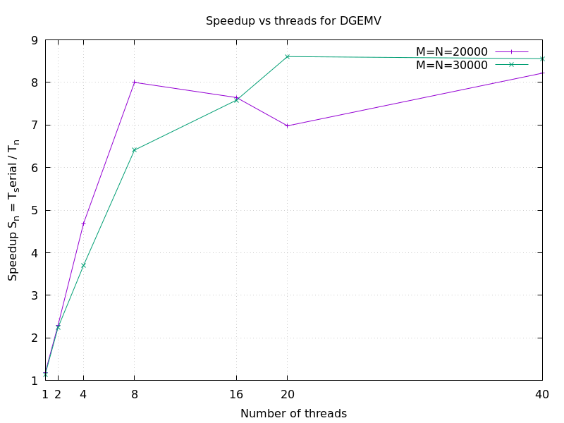

# Task 3 — DGEMV Performance Conclusions

## Source and Experiment Setup

**Source:** `DGEMV.cpp`

The program benchmarks dense matrix-vector multiplication
\[
c = A \cdot b
\]
for square matrices and reports speedup
\[
S_n = \frac{T_1}{T_n}
\]
where `T_1` is the single-thread baseline and `T_n` is runtime with `n` threads.

Tested configuration from the code:
- Matrix sizes: **M = N = 20000** and **M = N = 30000**
- Thread counts: **1, 2, 4, 8, 16, 20, 40**
- Plot output: `speedup_DGEMV_combined.png`

---

## Implementation Notes

Unlike OpenMP-based versions, this implementation uses **manual threading** with:
- `std::thread`
- custom `parallel_for(...)` static partitioning
- per-row independent accumulation in `dgemv_threads(...)`

---

## Measured Speedup

The measured DGEMV speedup curve for the `std::thread` implementation is essentially the same as the OpenMP version for the same matrix sizes and thread counts.

In other words: **OpenMP and threads show nearly identical speedup behavior** (small differences are expected from runtime/scheduling noise).

---

