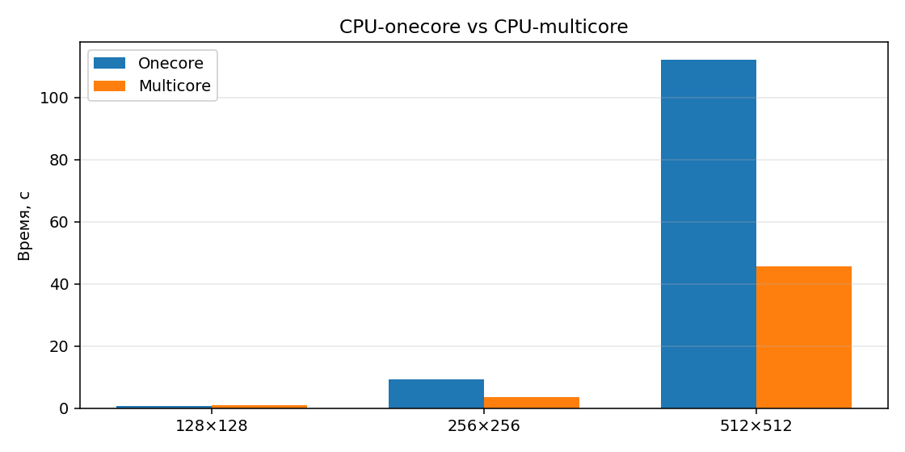
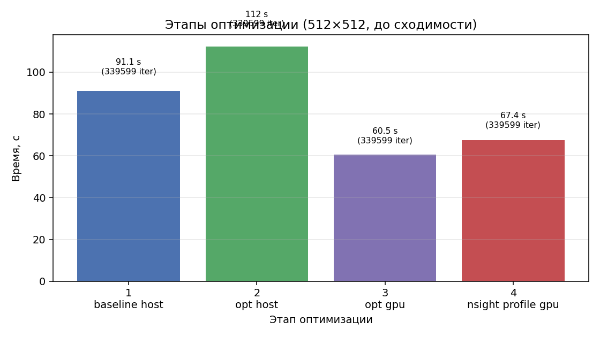
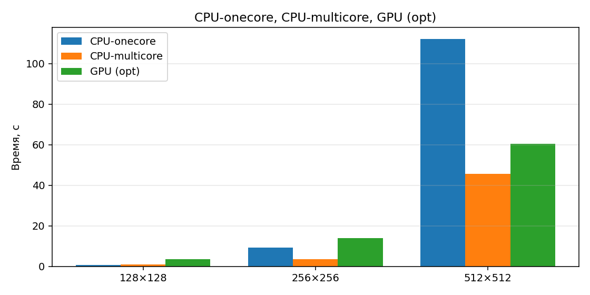

Теория параллельных вычислений

**Отчёт**

**Название программы (задачи):** Задание 6 — решение уравнения теплопроводности (пятиточечный шаблон, OpenACC)

**Выполнил:** группа 24940, **Крюк Михаил Витальевич**

**Дата:** 01.06.2026

---

**Цель работы**

Реализовать на C++ решение стационарного уравнения теплопроводности на равномерной 2D-сетке (пятиточечный шаблон, итерация Якоби); задать граничные условия (углы 10, 20, 30, 20, линейная интерполяция на рёбрах); распараллелить код директивами OpenACC; сравнить время на CPU (одно ядро / несколько ядер) и GPU; выполнить профилирование Nsight Systems и оптимизацию.

---

**Используемый компилятор**

**NVIDIA HPC SDK 26.3:** `nvc++`, флаги `-acc=host|multicore|gpu`, `-Minfo=accel`, `-O3`, `-std=c++17`.

Установка (WSL, без sudo): tarball в `~/.local/nvidia/hpc_sdk`; для GPU в WSL: `LD_LIBRARY_PATH=/usr/lib/wsl/lib`.

Сборка: `make host`, `make gpu`, `make multicore`. Режимы `gpu` и `multicore` требуют `nvc++` (см. `scripts/install_nvhpc.sh`).

На раннем этапе отладки использовался `g++ 11.4` с `-fopenacc` (без реального ускорения на GPU).

---

**Используемый профилировщик**

NVIDIA **Nsight Systems** (`nsys profile`).

Запуск: `./scripts/profile_nsight.sh gpu 512 1000000`

Файлы профиля: `results/nsys_N512_iter1000000_gpu.qdrep`, `results/nsys_N512_iter1000000_gpu.sqlite`

---

**Как производили замер времени работы**

Замер времени — библиотека **`<chrono>`** (`std::chrono::high_resolution_clock` в `heat_solver.cpp`).

Параметры: `--eps 1e-6`, `--max-iter 1000000`, `--size N`. Скрипт бенчмарка: `./scripts/benchmark.sh [host|multicore|gpu]`. Повторный прогон только GPU: `./scripts/rerun_gpu_only.sh`.

---

## Выполнение на CPU — CPU-onecore

Режим **`-acc=host`**, программа `build/heat_opt_host` (оптимизированный вариант).

| Размер сетки | Время выполнения, с | Точность    | Количество итераций |
| ------------ | ------------------- | ----------- | ------------------- |
| 128×128      | 0,663               | 9,9998×10⁻⁷ | 30 074              |
| 256×256      | 9,232               | 9,9993×10⁻⁷ | 102 885             |
| 512×512      | 112,243             | 9,9998×10⁻⁷ | 339 599             |
| 1024×1024    | *—*                 | *—*         | *—*                 |

*Источник: `results/timing_host.csv` (variant=opt). Baseline на host: 0,593 / 7,583 / 91,088 с — быстрее opt (см. анализ).*

---

## Диаграмма сравнения время работы CPU-one и CPU-multi

---

## CPU-multicore

Режим **`-acc=multicore`**, программа `build/heat_opt_multicore`.

| Размер сетки | Время выполнения, с | Точность    | Количество итераций |
| ------------ | ------------------- | ----------- | ------------------- |
| 128×128      | 0,927               | 9,9998×10⁻⁷ | 30 074              |
| 256×256      | 3,523               | 9,9993×10⁻⁷ | 102 885             |
| 512×512      | 45,581              | 9,9998×10⁻⁷ | 339 599             |
| 1024×1024    | *—*                 | *—*         | *—*                 |

*Источник: `results/timing_multicore.csv` (variant=opt).*

---

## Выполнение на GPU — этапы оптимизации на сетке 512×512

Замеры с **nvc++** до полной сходимости (339 599 ит., ε=10⁻⁶).

| Этап № | Время выполнения, с | Точность    | Максимальное количество итераций | Комментарии (что было сделано) |
| ------ | ------------------- | ----------- | -------------------------------- | ------------------------------ |
| 1      | 91,088              | 9,9998×10⁻⁷ | 1 000 000                        | Baseline: два OpenACC-цикла на итерацию (`heat_base_host`), `acc data copy` |
| 2      | 112,243             | 9,9998×10⁻⁷ | 1 000 000                        | Opt на CPU: слияние обновления и ошибки, `acc data create`, `vector_length(256)` (`heat_opt_host`) — **медленнее baseline на host** |
| 3      | 60,520              | 9,9998×10⁻⁷ | 1 000 000                        | Opt на GPU: `-acc=gpu`, тот же `heat_opt`, offload на GPU (`-Minfo=accel`: Generating NVIDIA GPU code) |
| 4      | 67,380              | 9,9998×10⁻⁷ | 1 000 000                        | Профилирование Nsight Systems (`--trace=cuda`, `--sample=none`) для `heat_opt_gpu` |

*Источник: `results/optimization_stages.csv`; этапы 1–2 — `timing_host.csv`; этап 3 — `timing_gpu.csv`; этап 4 — `results/last_profile_timing.txt`.*

**Примечание:** при сборке `g++ -fopenacc` этап 1→2 на 512×512 давал ~233 с → ~118 с (~2×). После перехода на **nvc++** выигрыш от «opt» проявляется на **GPU** (этап 3), а не на `-acc=host`.

**Nsight (этап 4):** timeline с CUDA API и kernel-регионами OpenACC; профиль до полной сходимости. Отчёт: `.qdrep` / `.sqlite`.

**Скриншоты Nsight:** открыть `results/nsys_N512_iter1000000_gpu.qdrep` в Nsight Systems GUI и приложить к отчёту (timeline, CUDA API, kernel regions).

---

## Диаграмма оптимизации

*Все этапы — время до сходимости на 512×512 (339 599 ит., ε=10⁻⁶), nvc++.*

---

## GPU — оптимизированный вариант

Режим **`-acc=gpu`**, программа `build/heat_opt_gpu`.

| Размер сетки | Время выполнения, с | Точность    | Количество итераций |
| ------------ | ------------------- | ----------- | ------------------- |
| 128×128      | 3,642               | 9,9998×10⁻⁷ | 30 074              |
| 256×256      | 13,945              | 9,9993×10⁻⁷ | 102 885             |
| 512×512      | 60,520              | 9,9998×10⁻⁷ | 339 599             |
| 1024×1024    | *—*                 | *—*         | *—*                 |

*Источник: `results/timing_gpu.csv` (variant=opt). Baseline GPU на 512×512: 67,921 с.*

---

## Сравнение 512×512 (opt, nvc++)

| Режим              | Время, с |
| ------------------ | -------- |
| CPU-onecore (host) | 112,243  |
| CPU-multicore      | 45,581   |
| GPU                | 60,520   |

---

## Диаграмма сравнения времени работы CPU-one, CPU-multicore, GPU (оптимизированный вариант) для разных размеров сеток

---

## Анализ (вопросы задания)

**1) Что ограничивает производительность?** Пропускная способность памяти (stencil 5 точек), большое число итераций Якоби (~3,4×10⁵ на 512×512). На GPU — переносы host↔device и запуск kernel; на CPU — эффективность векторизации и reduction.

**2) Как исправить?** Для GPU: `acc data create` + начальная загрузка обоих буферов `u` и `v` на устройство, слияние циклов, `-acc=gpu` и `nvc++`. Для CPU-multicore: `-acc=multicore` (лучший результат на 512×512 — 45,6 с). Оптимизации с `vector_length(256)` и fused reduction на `-acc=host` ухудшают время относительно baseline — их целесообразно применять на GPU.

**3) Делает ли программа что-то лишнее?** В baseline — отдельный проход для ошибки (на host с nvc++ это быстрее, чем слияние). В профилировании отключён CPU sampling (`--sample=none`) для совместимости с WSL.

---

**Вывод:**

Реализован решатель с параметрами по заданию (границы, Якоби, OpenACC, `boost::program_options`). Сборка и замеры выполнены с **NVIDIA HPC SDK (`nvc++`)** и реальным GPU offload (RTX 4070 Laptop, WSL).

На сетке **512×512** оптимизированный вариант на **GPU** (60,5 с) быстрее однопоточного CPU (112,2 с) и сопоставим с **multicore** (45,6 с); ускорение относительно GPU baseline (67,9 с) — около **12%**. Этап 2 на `-acc=host` не даёт ускорения (112 с против 91 с у baseline) — слияние циклов рассчитано на GPU.

Nsight Systems (этап 4) выполнен до полной сходимости; накладные расходы профилирования ~7 с относительно чистого прогона GPU. Отчёт профиля: `results/nsys_N512_iter1000000_gpu.qdrep`.
